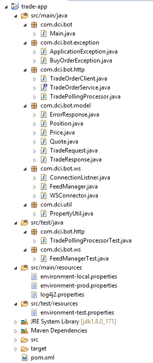
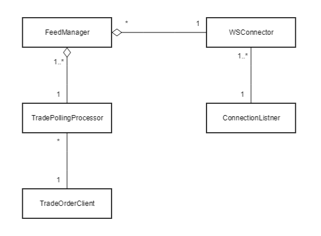

# Trade App

Trade App is is bot that tracks a trade and makes a purchase when a trade price is equal or lower than the buy price and then sells it when the price is equal or more than the upper limit or less than or equal to the lower limit.

## Prerequisites
* Java 8 update 101 or higher
* Maven 3.3 or higher

## Build and Run the app

* Get the source using from `https://github.com/deepcodersinc/trade-app.git` and build it using `$ mvn clean install` from the project root directory.
* Once build is successful, goto the `target` folder using the command `$ cd target`
* Enter the command `$ java -jar trade-app-0.0.1-SNAPSHOT-jar-with-dependencies.jar`

This will prompt the inputs:
- `productId` [String] ID of the product that needs to be tracked
- `buyPrice` [Float] Price at which you are willing to buy the product`
- `upperLimitSellPrice` [Float] The price to close a position and make a profit`
- `lowerLimitSellPrice` [Float] The price to close a position and make a loss`

Note that the rule is `upperLimitSellPrice > buyPrice > lowerLimitSellPrice`

## Project Structure

## Design

## Technology choices
* `nv-websocket-client` Light weight without needed to run containers on the client and provides flexible listener interface
* `Retrofit` Less of boilerplate code and nice mapping of Service Interfaces

#### Other Considerations
* `Spring websocket`
* `Project Tyrus`
* `Jetty`
* `okhttp`

## Improvements

* Increase Unit test coverage
* Better exception handling

## Open Issues

* When buy price and sell price are both less than the current price, the bot will buy and sell with no profit and loss.
* If sell is not possible for any reason, the bot keeps the position open and repetitively tries to sell even if the same error occurs.
